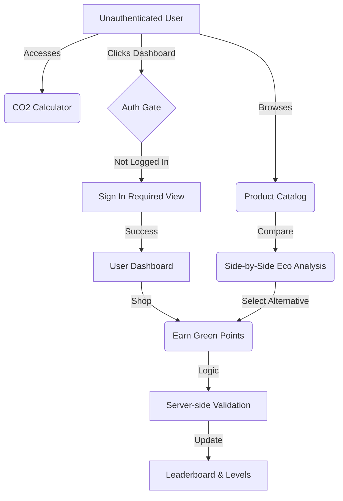
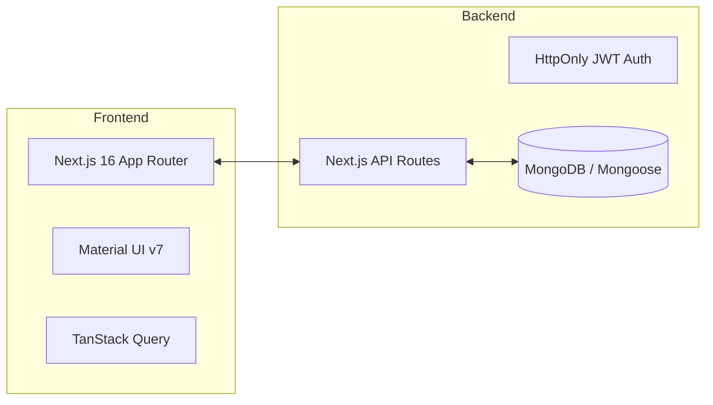

# 🌱 EcoRetail: Sustainable Shopping Platform

EcoRetail is a professional, full-stack e-commerce ecosystem designed to make sustainable living transparent, rewarding, and accessible. It empowers users to track their environmental impact in real-time while shopping for verified eco-friendly products.

---

## 🎯 Main Purpose

The core mission of EcoRetail is to bridge the gap between **consumer choice** and **environmental impact**. Most e-commerce platforms hide the carbon cost of products; EcoRetail puts it front and center, gamifying the experience to encourage lower-emission lifestyles through:
- **Transparency**: Real-time CO₂ data for every product.
- **Optimization**: AI-driven "Green Delivery" routing to minimize logistics footprints.
- **Recognition**: A comprehensive "Green Points" reward system that recognizes eco-conscious decisions.

---

## 📊 System Architecture & User Flow

### User Journey Flowchart


### Technical Stack


---

## ⚙️ How It Works

### 1. Smart Authentication
EcoRetail uses a secure **HttpOnly JWT Cookie** architecture. Unlike basic implementations that store user data in `localStorage`, EcoRetail verifies the session server-side for every protected request, ensuring your points and profile are safe from client-side spoofing.

### 2. Carbon Footprint Tracking
Every product in our catalog is analyzed for its CO₂ emissions.
- **Direct Comparison**: When viewing a product, the system automatically suggests a "Greener Alternative" if a similar item with a lower carbon footprint is available.
- **Total Impact**: Your dashboard aggregates the total CO₂ saved across all your purchases.

### 3. Green Delivery Optimizer
Our logistics engine calculates the most sustainable delivery route based on your location, reducing the last-mile delivery footprint—the most carbon-intensive part of the supply chain.

### 4. Gamified Rewards (Green Points)
Users earn experience points (XP) for:
- Choosing lower-emission products.
- Selecting optimized green delivery routes.
- Participating in community sustainability tips.
As you level up, you unlock achievement badges and exclusive sustainable deals.

---

### 🚀 Getting Started

### Prerequisites
- **Node.js**: v20 or higher
- **Database**: MongoDB instance (local or Atlas)

### Installation
1. **Clone the repository:**
   ```bash
   git clone [repository-url]
   cd eco-retail-next
   ```

2. **Install dependencies:**
   ```bash
   npm install
   ```

3. **Configure Environment:**
   Create a `.env.local` file in the root and add:
   ```env
   MONGODB_URI=your_mongodb_connection_string
   JWT_SECRET=your_secure_secret
   # Optional: GOOGLE_CLIENT_ID / GOOGLE_CLIENT_SECRET for OAuth
   ```

4. **Run Development Server:**
   ```bash
   npm run dev
   ```
   Visit [http://localhost:3000](http://localhost:3000) to explore the platform.

---

## 🛠️ Tech Stack
- **Framework**: [Next.js 16](https://nextjs.org/) (App Router & Turbopack)
- **UI & Styling**: [Material UI (MUI) v7](https://mui.com/), Vanilla CSS (Design Tokens)
- **Database**: [MongoDB](https://www.mongodb.com/) with [Mongoose](https://mongoosejs.com/)
- **State Management**: [TanStack Query v5](https://tanstack.com/query)
- **Authentication**: Custom JWT (HttpOnly Cookies)
- **Visuals**: [Recharts](https://recharts.org/) & [Lucide Icons](https://lucide.dev/)

---

## 📁 Project Structure
- `src/app/` — Pages and API Route handlers (Auth, Rewards, Products).
- `src/components/` — Refactored, premium UI components (Navbar, GreenPoints, AuthGate).
- `src/styles/` — Global design system tokens and theme overrides.
- `public/` — Static branded assets.

---

## 📄 License
This project is licensed under the MIT License.
